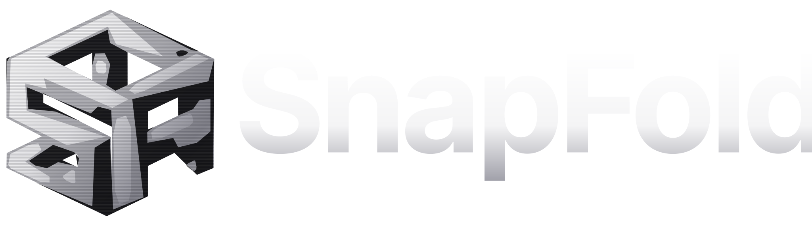

# SnapFold

<p align="center"></p>

[](https://github.com/ErChulo/snapfold/actions/workflows/deploy.yml)
[](https://github.com/ErChulo/snapfold/actions/workflows/desktop.yml)


SnapFold turns overlapping photographs into a 3D reconstruction and is being developed toward curvature-aware printable paper/cardboard models.

## v0.3.0-alpha.1: native reconstruction

The serious reconstruction path is now a **Tauri/React desktop application using native COLMAP**, separate from the earlier browser SfM experiment.

```text
choose local photos
→ COLMAP SIFT feature extraction (CPU)
→ exhaustive geometric matching
→ incremental Structure-from-Motion
→ triangulation + bundle adjustment
→ colored sparse PLY
→ optional sparse Delaunay surface
→ Three.js model viewer
```

No synthetic prism is used in the desktop reconstruction workflow.

### Linux Mint 22.x / Ubuntu 24.04

GitHub Actions publishes a Debian package in the prerelease:

```text
SnapFold Desktop v0.3.0-alpha.1
```

Install it with:

```bash
sudo apt install ./<downloaded-snapfold-package>.deb
```

The package declares **`colmap` as an APT dependency**, so APT installs Ubuntu Noble's native COLMAP package automatically. Linux Mint 22.x uses the Ubuntu Noble package base.

Then launch SnapFold, choose the photographs in Step 2, and press **Build real 3D reconstruction** in Step 3. The resulting COLMAP PLY is rendered directly in the app.

The selected photographs are copied only into a local SnapFold workspace. They are not uploaded to SnapFold or a reconstruction service.

## Capture protocol

Use overlapping photographs of a stationary object. Target roughly 60–80% overlap, keep focal length fixed, keep the object stationary, and avoid changing zoom.

## Web application

The GitHub Pages build remains at:

https://erchulo.github.io/snapfold/

The web reconstruction code is retained as an experimental diagnostic. It is not the native COLMAP reconstruction path.

## Desktop architecture

```text
React / Vite
    ↓ Tauri invoke + progress events
Rust / Tauri
    ↓ local process
COLMAP 3.9.1 CPU from Ubuntu Noble
    ↓
PLY point cloud / optional PLY mesh
    ↓
Three.js viewer
```

## Development

```bash
sudo apt install colmap
npm install
npm run desktop:dev
```

Production Debian package:

```bash
npm run tauri build -- --bundles deb
```

The Debian package explicitly depends on `colmap`.

## Existing legacy papercraft pipeline

The v0.1.x prism net, tabs, Letter layout, and vector PDF generator remain in the repository as regression/reference code. They are not presented as native reconstruction output.
